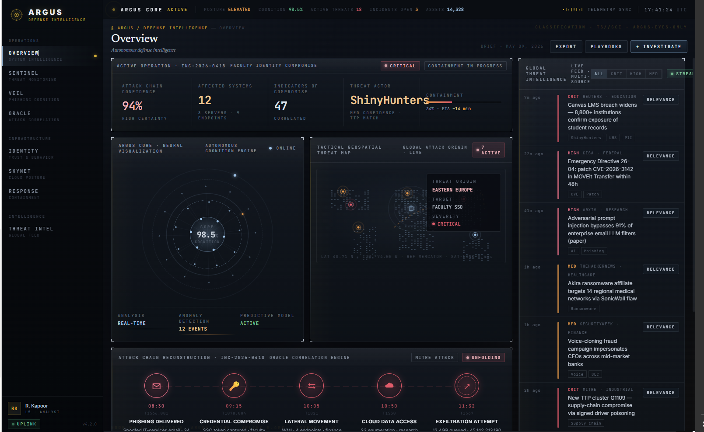
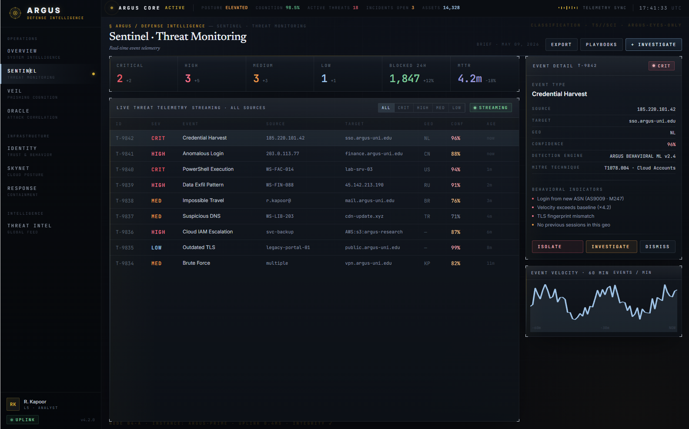
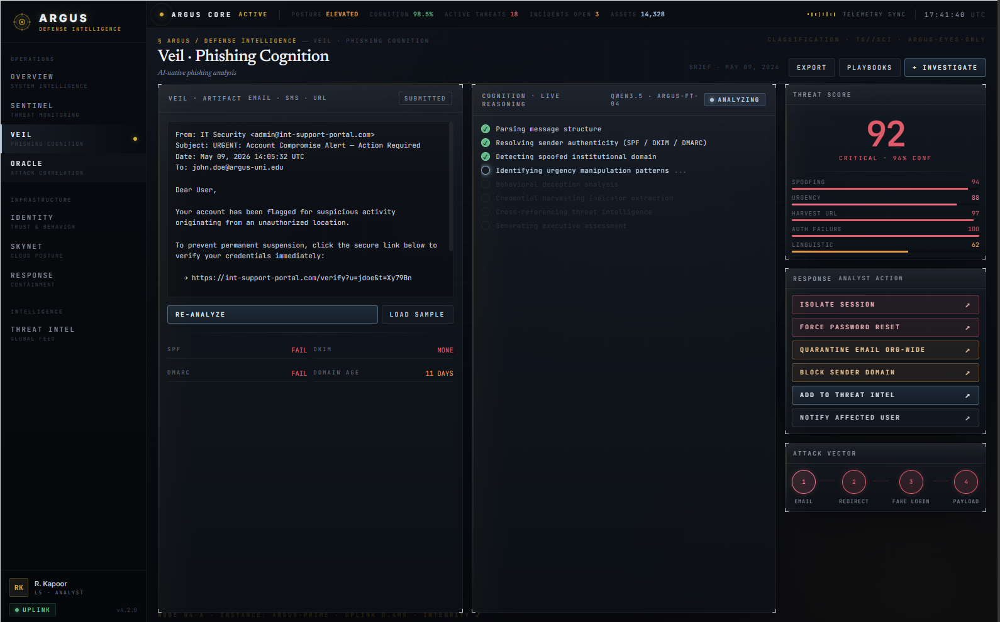
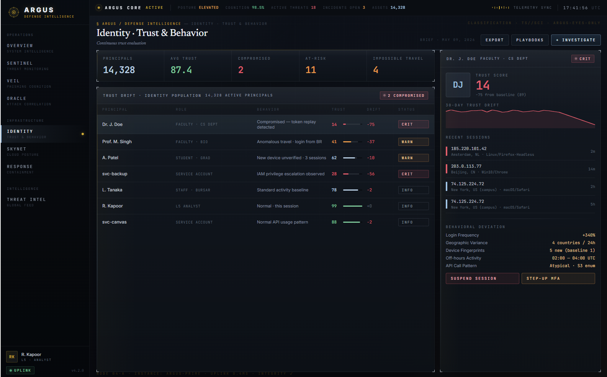
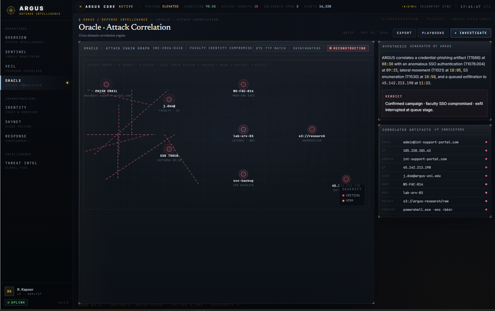
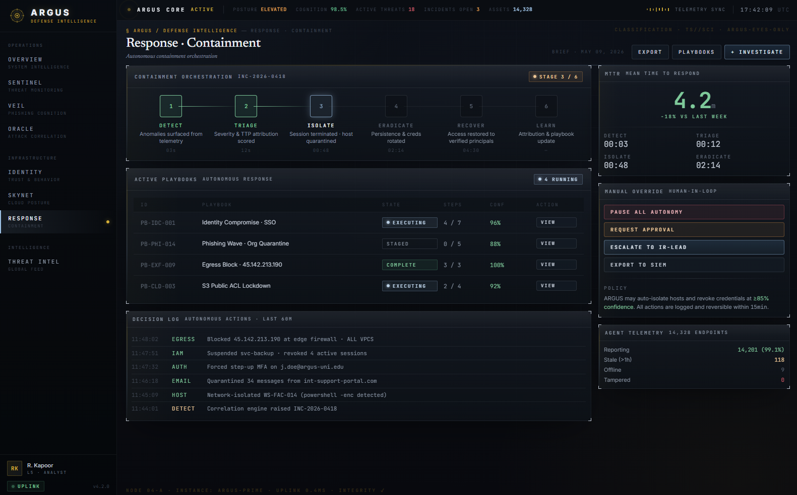
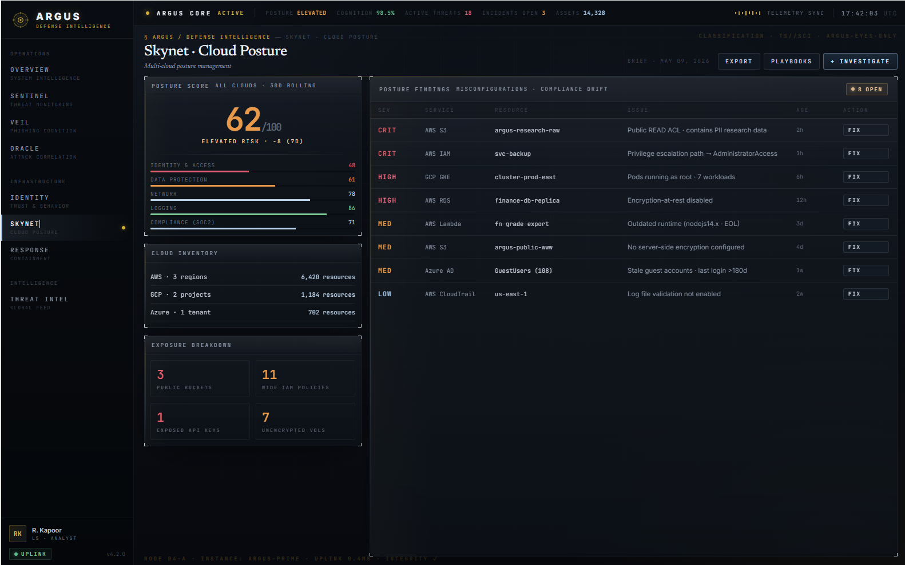

# ARGUS — Autonomous Cyber Defense Intelligence Platform

> *Named after Argus Panoptes — the hundred-eyed Greek titan who never sleeps.*

ARGUS is a full-stack AI-powered Security Operations Center (SOC) dashboard built for university and enterprise environments. It monitors threats in real time, analyzes phishing with large language models, scores identity trust using behavioral signals, visualizes attack chains as interactive node graphs, audits cloud infrastructure compliance, drives autonomous incident response, and quantifies breach probability using a peer-reviewed probabilistic model — all from a single dark-glass intelligence console.

---

## Overview



The Overview module is the command center of ARGUS. The left sidebar provides dark-glass navigation across all nine modules grouped by function (Intelligence, Surveillance, Defense, Infrastructure). The main canvas features a live threat actor spotlight (ShinyHunters — 601K+ records), real-time system counters, the ARGUS AI Core radial sphere visualization, a global threat map with active incident markers, and a full attack kill chain strip at the bottom tracing the live intrusion path: **Phishing Delivery → Credential Compromise → Lateral Movement → Cloud Data Access → Exfiltration Attempt**.

---

## Modules

### SENTINEL — Threat Monitoring



Real-time SIEM-style threat monitoring. The header displays live aggregate stats — critical events, high events, active sessions (1,847), and total events processed (4.2M). The main table shows a filterable, sortable event feed with CRITICAL / HIGH / MEDIUM / LOW severity badges, timestamps, source IPs, and event types. Selecting any event opens a right-side detail panel with an activity sparkline, source intelligence breakdown (geo, ISP, proxy status), behavioral indicators, MITRE ATT&CK TTP mapping, and ANALYZE / INVESTIGATE action buttons. Real system threat detection runs alongside simulated events — flagged local processes and external connections are ingested live.

---

### VEIL — Phishing Cognition Engine



AI-powered phishing and social engineering analysis. Paste any suspicious email, SMS message, or URL into the left panel — ARGUS runs it through a 7-stage detection pipeline powered by Qwen3.6-35B-A3B via Featherless. The right panel returns a 0–100 phish risk score rendered as a red confidence bar (92/100 CRITICAL in the screenshot), attack classification, psychological manipulation vectors detected, and an executive threat briefing. Action buttons below the score allow one-click response: **Create Ticket**, **Track Threat Agent**, **Quarantine Mail and User**, **Block Domain Sender**, **Add to Threat Intel**, **Notify Impacted Users**.

---

### IDENTITY — Trust & Behavior



Zero-trust behavioral trust scoring for active user sessions. The header shows aggregate stats: total sessions (16,328), average trust score (87.4), anomalies detected (11), and critical sessions (4). The main table lists institutional personas with per-row trust score bars and status badges (BLOCKED / REVOKE / MONITOR / REVIEW). Clicking any user expands a right-side panel with a trust score ring visualization (DJ — score 14), a declining trust timeline chart, active session IPs, behavioral flags, and operator action buttons — **Suspend Session** and **Stay at MFA**.

---

### ORACLE — Attack Correlation



Multi-source attack chain correlation engine. ORACLE ingests signals from every ARGUS module and reconstructs full attack chains as an interactive SVG node graph — nodes represent attack stages (Phish Email → Credential Harvest → C2 TLS → DNS Tunnel → Exfil Data) with animated connection lines showing data flow direction. The right panel shows the AI-generated executive incident narrative (powered by NVIDIA Nemotron 49B or Kimi-K2.6) and a correlated detection events log with timestamps, module attribution, and severity. When real incident data is sparse, ORACLE renders a high-fidelity simulated APT incident using a 6-TTP kill chain.

---

### RESPONSE — Containment



Autonomous incident response orchestration. The header shows a 6-stage response pipeline: **DETECT → TRIAGE → ISOLATE → ERADICATE → RECOVER → REVIEW** — the active stage is highlighted in amber. A live timer (4.2 hours) tracks response duration alongside mission clock readouts. The active response actions table below lists containment steps with live status badges (EXECUTING / COMPLETE / LOW). A terminal-style playbook execution log streams at the bottom, showing timestamped actions as they complete: session termination, firewall block, forensic capture, credential rotation, and SOC escalation. Operator quick-action buttons (Pause All, Regenerate Plan, Investigate) appear on the right.

---

### SKYNET — Cloud Posture



Cloud Security Posture Management (CSPM). A circular compliance gauge on the left shows 62/100 (ELEVATED RISK) with critical/high/medium/low severity breakdown stats. Cloud inventory panels show AWS (2 regions), GCP (4 resources), and Azure (1 tenant) coverage. A full findings table on the right lists every detected misconfiguration with priority severity bars, resource name, issue description, CIS benchmark control mapping, and remediation status. Compliance framework tabs (Timeline, Frameworks, Troubleshoot, Compliance Best) allow multi-view analysis. Findings include critical issues like public S3 buckets with student PII, root account MFA disabled, and production database ports exposed to the internet.

---

### THREAT INTEL — Intelligence Feed


Aggregated threat intelligence feed with real-time RSS from The Hacker News, SecurityWeek, Krebs on Security, BleepingComputer, Dark Reading, Infosecurity Magazine, and CISA Advisories. Filter tabs segment items by type: ALL / THREATS / INTELLIGENCE / NATION-STATE / CRIME / CVE. Each feed item shows publication time, source badge, and an education-sector relevance indicator. The right panel features a rotating threat actor profile (ShinyHunters in the screenshot) with attribution details, primary targets, recent campaign activity, TTPs, and days since last confirmed operation.

---

### IEM — Identity Exploitation Model

The IEM module implements the quantitative breach risk framework from Raj Bharti's IEEE TIFS 2026 paper — *"The Identity Exploitation Model: A Sequential Probabilistic Framework for Quantifying Compound Breach Risk in AiTM Phishing Campaigns Against Higher Education Institutions."*

**Formula:** `P(breach) = P(L1) · P(L2|L1) · P(L3|L2) · P(L4|L3)`

The module surfaces six interactive panels:

- **Institution Breach Probability** — Animated bar chart comparing Monte Carlo results (N=100,000, seed=42) across five universities (Harvard 61.2%, UPenn, Columbia, Princeton, Michigan) with 95% confidence intervals. Each bar shows MFA type, records exposed, and attack vector.

- **Intervention Sensitivity** — Ranked analysis of security interventions and their breach probability reduction. FIDO2 hardware key migration tops the list at −72% (Harvard baseline → 17.2%), followed by phishing-resistant training, AiTM-aware SOC tuning, and session monitoring.

- **MFA Attack Scenario Matrix** — 5×5 heatmap of P(breach) across five attack types (Vishing, Credential Stuffing, AiTM EvilProxy, Spear-Phishing, BEC) × five MFA methods (None, SMS OTP, Push MFA, TOTP, FIDO2). Cells are color-coded: red ≥70%, amber 45–70%, blue 20–45%, teal <20%.

- **Campaign Prediction** — Interactive slider (5–200 targets) computing E[B] = N × P(breach) for ShinyHunters-style mass campaigns. Shows expected breach count alongside a FIDO2 counterfactual (breaches prevented).

- **Real-time IEM Assessment** — Live scoring form where operators toggle active signals (impossible travel, TOR exit node, new device, data exfil spike, phishing detected) and set MFA type / institution. Submitting runs Monte Carlo estimation and returns P(breach), 95% CI, risk tier (CRITICAL / HIGH / ELEVATED / MODERATE), per-layer probabilities (L1–L4), and a recommendation. Scores >55% automatically push a signal to the Oracle correlation engine.

- **IEM Layer Architecture** — Visual breakdown of the four sequential probability layers with MITRE ATT&CK TTP mappings: L1 Human Trust (T1566.001), L2 Authentication (T1078 / T1621), L3 Interception (T1550.001), L4 Privilege (T1021 / T1567.002).

---

## Tech Stack

### Backend
- **Python 3.11** / **FastAPI** — async routes throughout
- **Multi-provider AI router** — Featherless (primary) + NVIDIA NIM (secondary)
  - VEIL: `Qwen/Qwen3.6-35B-A3B`
  - ORACLE: `nvidia/llama-3.3-nemotron-super-49b-v1` → `moonshotai/Kimi-K2.6` fallback
  - RESPONSE: `fdtn-ai/Foundation-Sec-8B-Reasoning`
- **IEM engine** — Monte Carlo simulation (N=100,000, seed=42) implementing IEEE TIFS 2026 sequential probability model
- **psutil** — real CPU, memory, disk, process, and network telemetry
- **feedparser** — live RSS ingestion from 7 security news sources
- **httpx** — async HTTP for CISA KEV, CVE feeds, ip-api.com, AbuseIPDB, GreyNoise
- **Poetry** — dependency management
- **Pydantic v2** — settings and request/response validation

### Frontend
- **React 18** + **Vite**
- **Tailwind CSS** — ARGUS dark glassmorphism design system (`--surface-base: #07090d`, `--accent-cyan: #8baeb4`, `--accent-amber: #a68b4b`, `--accent-critical: #a85c5c`)
- **Framer Motion** — animated transitions, node graph particles, IEM bar reveals, trust ring animations
- **Lucide React** — icons
- **SVG** — custom sparklines, trust rings, compliance gauges, attack node graphs, IEM probability bars

---

## Quick Start

### 1. Clone

```bash
git clone https://github.com/Rajbharti06/ARGUS.git
cd ARGUS
```

### 2. Backend

```bash
cd backend
poetry install
```

Copy the example env file and add your API keys:

```bash
cp .env.example .env
```

```env
# Required — get a free key at featherless.ai
FEATHERLESS_API_KEY=your_featherless_key

# Optional — for ORACLE high-quality narratives
NVIDIA_API_KEY=your_nvidia_key

# Optional — for enhanced IP threat intelligence
ABUSEIPDB_API_KEY=your_abuseipdb_key
GREYNOISE_API_KEY=your_greynoise_key
```

Start the backend:

```bash
poetry run uvicorn app.main:app --reload
```

Backend runs on `http://localhost:8000`.

### 3. Frontend

```bash
cd frontend
npm install
npm run dev
```

Frontend runs on `http://localhost:5173`. Vite proxies `/api/*` to the FastAPI backend automatically.

---

## API Reference

All ARGUS module endpoints are prefixed with `/api/argus`.

| Method | Endpoint | Module | Description |
|--------|----------|--------|-------------|
| `GET` | `/api/argus/sentinel/events` | SENTINEL | Live threat event feed with severity, IPs, TTP mapping |
| `GET` | `/api/argus/sentinel/stats` | SENTINEL | System metrics (threats blocked, risk score, uptime) |
| `POST` | `/api/argus/veil/analyze` | VEIL | AI phishing analysis — risk score, indicators, narrative |
| `POST` | `/api/argus/veil/stream` | VEIL | SSE streaming endpoint for real-time AI token output |
| `POST` | `/api/argus/identity/score` | IDENTITY | Zero-trust session scoring (0–100) from behavioral signals |
| `GET` | `/api/argus/oracle/timeline` | ORACLE | AI-correlated attack timeline + MITRE ATT&CK kill chain |
| `GET` | `/api/argus/skynet/scan` | SKYNET | Cloud findings + compliance score + CIS benchmarks |
| `POST` | `/api/argus/response/recommend` | RESPONSE | AI incident response playbook by severity and event type |
| `GET` | `/api/argus/iem/institutions` | IEM | Monte Carlo breach probability for 5 universities (Table IV) |
| `GET` | `/api/argus/iem/sensitivity` | IEM | Intervention sensitivity analysis — breach reduction by control |
| `GET` | `/api/argus/iem/simulator` | IEM | 5×5 MFA × attack type scenario matrix (Table IX) |
| `GET` | `/api/argus/iem/campaign` | IEM | ShinyHunters campaign prediction — E[B] = N × P(breach) |
| `POST` | `/api/argus/iem/realtime` | IEM | Real-time IEM assessment from live operator-supplied signals |

Intelligence data endpoints (no AI, real telemetry):

| Method | Endpoint | Description |
|--------|----------|-------------|
| `GET` | `/api/intelligence/system` | Real CPU, memory, disk, processes via psutil |
| `GET` | `/api/intelligence/network` | Active TCP connections with risk scoring |
| `GET` | `/api/intelligence/news` | Live RSS from 7 cybersecurity news sources |
| `GET` | `/api/intelligence/threats` | CVEs from circl.lu + threat actor database |
| `GET` | `/api/intelligence/cisa-kev` | CISA Known Exploited Vulnerabilities catalog |
| `GET` | `/api/intelligence/ip-intel/{ip}` | Multi-source IP enrichment (ip-api + AbuseIPDB + GreyNoise) |
| `GET` | `/api/intelligence/ttps` | Full ARGUS MITRE ATT&CK TTP reference table |

---

## Project Structure

```
ARGUS/
├── backend/
│   ├── app/
│   │   ├── core/
│   │   │   ├── config.py          # Pydantic settings, API keys, model routing
│   │   │   └── logging.py
│   │   ├── routes/
│   │   │   ├── argus.py           # All 8 module endpoints (Sentinel → IEM)
│   │   │   └── intelligence.py    # Real telemetry endpoints
│   │   ├── services/
│   │   │   ├── ai_router.py       # Multi-provider LLM router with fallbacks
│   │   │   ├── oracle.py          # Correlation engine — signal → incident
│   │   │   ├── iem.py             # Identity Exploitation Model Monte Carlo engine
│   │   │   ├── threat_intel.py    # Multi-source IP enrichment + TTP mapping
│   │   │   └── telemetry.py       # psutil system + network telemetry
│   │   └── main.py
│   ├── .env.example
│   └── pyproject.toml
├── frontend/
│   ├── src/
│   │   ├── components/
│   │   │   ├── OverviewModule.jsx      # Command center dashboard
│   │   │   ├── SentinelModule.jsx      # SIEM table + event detail
│   │   │   ├── VeilModule.jsx          # Phishing AI analysis
│   │   │   ├── IdentityModule.jsx      # Zero-trust session scoring
│   │   │   ├── OracleModule.jsx        # Attack correlation node graph
│   │   │   ├── SkynetModule.jsx        # Cloud posture + compliance
│   │   │   ├── ResponseModule.jsx      # Incident response pipeline
│   │   │   ├── ThreatIntelModule.jsx   # Intelligence feed + threat actors
│   │   │   ├── IEMModule.jsx           # Identity Exploitation Model
│   │   │   └── ui/                    # Shared components (ArgusCore, feeds, panels)
│   │   ├── utils/
│   │   │   └── cn.js                  # Tailwind class merging
│   │   ├── App.jsx                    # Shell, sidebar nav, module routing
│   │   └── index.css                  # ARGUS dark glass design system + animations
│   ├── tailwind.config.js
│   └── vite.config.ts
└── screenshots/                       # Module reference screenshots
```

---

## AI Provider Setup

ARGUS uses a multi-provider AI router with automatic fallbacks:

```
VEIL:     Featherless (Qwen3.6-35B-A3B)       → NVIDIA fallback
ORACLE:   NVIDIA Nemotron 49B                  → Featherless (Kimi-K2.6) fallback
RESPONSE: Featherless (Foundation-Sec-8B-Reasoning)
FAST:     Featherless (GLM-5.1)
FALLBACK: Featherless (Llama-3.1-8B-Instruct)
```

**Featherless** (recommended) — free tier available, runs 500+ open-source models via OpenAI-compatible API. Get a key at [featherless.ai](https://featherless.ai).

**NVIDIA NIM** — high-quality inference for Nemotron, Llama, and Mistral models. Get a key at [build.nvidia.com](https://build.nvidia.com).

**AbuseIPDB** — free tier: 1,000 IP checks/day. Enhances Sentinel IP enrichment and VEIL URL reputation. Get a key at [abuseipdb.com](https://www.abuseipdb.com).

**GreyNoise** — Community free tier: scanner/noise classification for IPs. Get a key at [greynoise.io](https://www.greynoise.io).

---

## Demo Flow

1. Open `http://localhost:5173`
2. **OVERVIEW** — watch live threat counters; ShinyHunters card shows 601K+ exposed records; kill chain strip shows active intrusion stage
3. **SENTINEL** — filter by CRITICAL severity; click "Credential Harvest" to see sparkline + geo-intel + TTP panel
4. **VEIL** — click "IT Security Alert" sample, hit **Initiate Analysis** — watch the 7-stage pipeline complete and return 92/100 CRITICAL with action buttons
5. **IDENTITY** — click "DJ" (trust score 14) to see the declining trust timeline and BLOCKED session status
6. **ORACLE** — click **Execute Correlation** — watch the attack node graph animate; read the AI-generated incident narrative
7. **RESPONSE** — click **Run Playbook** — watch the terminal log stream as containment actions execute stage by stage
8. **SKYNET** — view the 62/100 compliance gauge and findings table with CIS benchmark control mappings
9. **THREAT INTEL** — browse live security news; click ShinyHunters in the right panel to see full threat actor profile
10. **IEM** — view the institution breach probability bars (Harvard 61.2%); toggle signals in Real-time Assessment and click **Run Assessment** to compute live P(breach)

---

## Research

The IEM module implements the quantitative model from:

> Raj Bharti. *"The Identity Exploitation Model: A Sequential Probabilistic Framework for Quantifying Compound Breach Risk in Adversary-in-the-Middle Phishing Campaigns Against Higher Education Institutions."* IEEE Transactions on Information Forensics and Security (TIFS), 2026.

All Monte Carlo results (N=100,000, seed=42) reproduce Table IV and Table IX of the paper. The FIDO2 −72% breach reduction finding is derived from the L2 authentication layer range calibration (18–35% vs 85–98% for Push MFA).

---

## License

MIT
