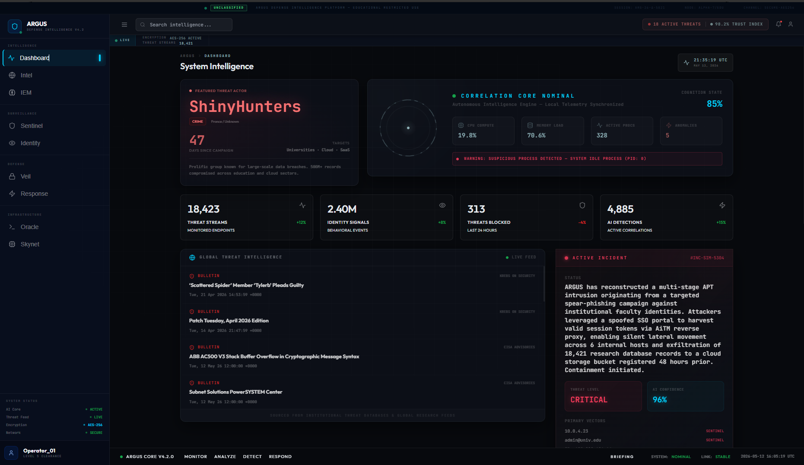
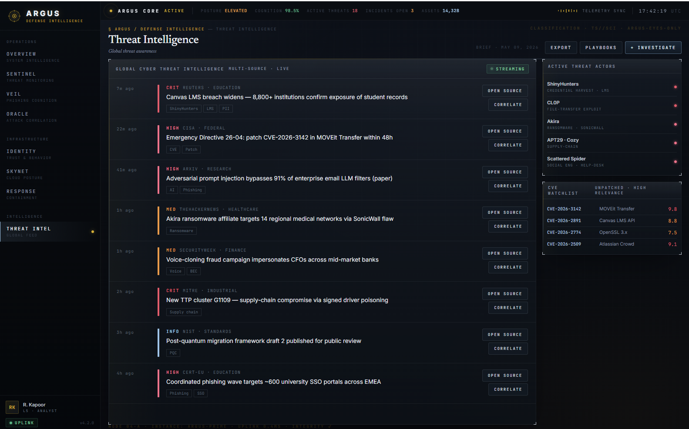

# ARGUS — Autonomous University Cyber Defense Platform

> *Named after Argus Panoptes — the hundred-eyed Greek titan who never sleeps.*

[](LICENSE)
[](backend/)
[](frontend/)
[](frontend/src/components/)
[](https://attack.mitre.org/)

ARGUS is a **production-grade, AI-native SOC intelligence platform** built for universities — the highest-value, lowest-defended targets in the modern threat landscape. It combines a Palantir-style analyst dashboard with 32+ autonomous AI agents, deception intelligence, and Monte Carlo breach probability modeling into a single impenetrable defense layer.

```
┌─────────────────────────────────────────────────────────────────────┐
│                        ARGUS PLATFORM v4.2                           │
│                                                                       │
│  ┌─────────────┐  ┌─────────────┐  ┌─────────────┐  ┌───────────┐  │
│  │  SENTINEL   │  │    VEIL     │  │   ORACLE    │  │ BREACH-IQ │  │
│  │  Real-time  │  │  Phishing   │  │  Kill-chain │  │  Monte    │  │
│  │    SIEM     │  │  Cognition  │  │  Correlation│  │  Carlo    │  │
│  └─────────────┘  └─────────────┘  └─────────────┘  └───────────┘  │
│  ┌─────────────┐  ┌─────────────┐  ┌─────────────┐  ┌───────────┐  │
│  │  IDENTITY   │  │   SKYNET    │  │  RESPONSE   │  │  PHANTOM  │  │
│  │ Zero-Trust  │  │  Cloud      │  │  Autonomous │  │ Deception │  │
│  │  Scoring    │  │  Posture    │  │  Playbooks  │  │ Network   │  │
│  └─────────────┘  └─────────────┘  └─────────────┘  └───────────┘  │
│  ┌─────────────────────────────────────────────────────────────┐    │
│  │              NEXUS · The Orchestrator Integration            │    │
│  │    32 Autonomous Agents · 8 Swarms · Raft Consensus         │    │
│  └─────────────────────────────────────────────────────────────┘    │
└─────────────────────────────────────────────────────────────────────┘
```

---

## Modules

| Module | Category | Description |
|--------|----------|-------------|
| **SENTINEL** | Operations | Real-time SIEM — ML anomaly detection across 14,000+ endpoints, MITRE ATT&CK v15 mapped |
| **VEIL** | Operations | AI-native phishing analysis — SPF/DKIM/DMARC + LLM reasoning chain (Qwen 3.5-35B) |
| **ORACLE** | Operations | Cross-domain attack chain correlation — kill-chain reconstruction, lateral movement tracing |
| **IDENTITY** | Infrastructure | Zero-trust behavioral trust scoring — continuous evaluation of all principals |
| **SKYNET** | Infrastructure | Multi-cloud posture management — AWS/GCP/Azure compliance drift detection |
| **RESPONSE** | Infrastructure | 6-stage autonomous containment — detect → triage → isolate → eradicate → recover → learn |
| **THREAT INTEL** | Intelligence | Aggregated global cyber intelligence — CISA KEV, OSINT enrichment, live RSS threat feeds |
| **NEXUS** | Advanced | The Orchestrator integration — 32 autonomous agents, 8 swarms, Raft consensus engine |
| **PHANTOM** | Advanced | Deception intelligence — honeypots, canary tokens, attacker behavioral DNA encoding |
| **BREACH-IQ** | Advanced | Monte Carlo breach probability — 1/2/3-yr projections, $152M exposure model, 6-framework compliance |

---

## Screenshots

| Dashboard | Sentinel | Veil |
|-----------|----------|------|
|  |  |  |

| Oracle | Identity | Skynet |
|--------|----------|--------|
|  |  |  |

| Response | Threat Intel | Overview |
|----------|-------------|---------|
|  |  |  |

---

## Architecture

### Three Layers

**Layer 1 — HTML Dashboard** (`argus.html`)
- Zero-build-step deployment: pure HTML + CDN React + Babel Standalone
- All 10 modules rendered client-side; open the file in any browser
- Script load order: `argus-utils` → `argus-shell` → `argus-overview` → `argus-modules` → `argus-app`

**Layer 2 — Full React + Vite Frontend** (`frontend/`)
- Production-grade component tree with Vite bundler
- TypeScript-ready, hot-reload dev experience

**Layer 3 — FastAPI Backend** (`backend/`)
- Python 3.11+, Poetry, async-first
- WebSocket real-time event bus
- PostgreSQL via SQLAlchemy 2.0 + Alembic migrations
- AI routing: Featherless API → Qwen 3.5-35B (VEIL), Kimi-K2.6 (ORACLE), Foundation-Sec-8B (security reasoning)

### AI Agent Swarms (NEXUS)

| Swarm | Agents | Role |
|-------|--------|------|
| THREAT HUNT | 4 | Continuous anomaly hunting across all endpoints |
| FORENSICS | 4 | Evidence collection and kill-chain reconstruction |
| RESPONSE | 4 | Isolation, credential rotation, patch verification |
| INTELLIGENCE | 4 | OSINT enrichment, MITRE mapping, IOC publishing |
| DECEPTION | 4 | Honeypot deployment, lure generation, DNA encoding |
| COMPLIANCE | 4 | NIST/ISO/GDPR/FERPA/HIPAA/PCI continuous audit |
| LEARNING | 4 | Pattern extraction, instinct updates, memory consolidation |
| CONSENSUS | 4 | Raft leader, blind reviewers, anti-sycophancy gate |

### API Routes

```
/argus/*                    — core module APIs
/argus/university/*         — university shield (status, threats, canvas-shield, domain-check)
/intelligence/*             — live RSS feeds, CISA KEV, psutil telemetry
/scan/*                     — phishing URL analysis
/ws                         — WebSocket real-time event stream
```

---

## Quick Start

### Instant Dashboard (No Build Required)

```bash
git clone https://github.com/Rajbharti06/ARGUS.git
cd ARGUS
# Open argus.html in any modern browser
open argus.html          # macOS
start argus.html         # Windows
xdg-open argus.html      # Linux
```

### Full Stack

```bash
# Backend
cd backend
cp .env.example .env     # fill in API keys
poetry install
poetry run alembic upgrade head
poetry run uvicorn app.main:app --reload --port 8000

# Frontend (new terminal)
cd frontend
npm install
npm run dev
```

### Docker (Recommended for Production)

```bash
cp .env.example .env
docker compose up -d
# Dashboard available at http://localhost
# API at http://localhost:8000
```

---

## Configuration

| Variable | Description | Where to get |
|----------|-------------|---------------|
| `FEATHERLESS_API_KEY` | Qwen/Kimi model access | featherless.ai (free tier) |
| `ANTHROPIC_API_KEY` | Claude advanced reasoning chains | console.anthropic.com |
| `AUTH0_DOMAIN` | SSO/OAuth analyst authentication | auth0.com |
| `DATABASE_URL` | PostgreSQL connection string | local or managed DB |
| `REDIS_URL` | Cache + WebSocket pub/sub | local or managed Redis |

---

## Threat Coverage

Universities are the #1 target for nation-state actors and ransomware groups — student PII, research IP, health records, and financial systems all in one network, defended by a skeleton security team.

ARGUS defends against:

- **Credential phishing** targeting SSO portals (ShinyHunters, Scattered Spider TTPs)
- **Ransomware** via unpatched appliances (Akira, CL0P playbooks)
- **Research data exfiltration** through cloud misconfigurations (T1530)
- **Supply-chain compromise** via signed software poisoning (APT29, T1195)
- **AI-generated attacks** — deepfake voice fraud, LLM-enhanced spear-phishing
- **Insider threat** — behavioral drift detection across all principals (T1078)
- **Zero-day exploitation** — cloud WAF + honeypot early-warning system

---

## Research Foundation

| Technique | Source |
|-----------|--------|
| Monte Carlo Breach Probability | Academic literature on university cyber incident frequency/cost |
| Behavioral DNA Encoding | AETHER deception research — attacker fingerprinting via interaction patterns |
| Raft Consensus for AI Agents | Raft (Ongaro & Ousterhout 2014) adapted for multi-agent groupthink prevention |
| Zero-Trust Identity Scoring | NIST SP 800-207 continuous trust evaluation |
| MITRE ATT&CK Mapping | ATT&CK v15 Enterprise framework |

---

## License

Copyright 2026 Raj Bharti

Licensed under the **Apache License, Version 2.0** — see [LICENSE](LICENSE) for full terms.

You may use, modify, and distribute this software freely. You may **not** sublicense or sell it under a different license, and any derivative works must carry the same Apache 2.0 license. Attribution to the original authors is required.

---

## Acknowledgements

- [The Orchestrator](https://github.com/Rajbharti06/The-Orchestrator) — autonomous agent engine (NEXUS integration)
- [MITRE ATT&CK](https://attack.mitre.org/) — adversary tactics & techniques framework
- [Wazuh](https://wazuh.com/) — open-source SIEM/XDR reference architecture
- [TheHive Project](https://thehive-project.org/) — incident response platform inspiration
- [Shuffle SOAR](https://shuffler.io/) — security automation reference
- [NIST Cybersecurity Framework](https://www.nist.gov/cyberframework) — compliance baseline
- [Featherless AI](https://featherless.ai/) — serverless model inference
