# ARGUS — Palantir-Class Autonomous Cyber Defense Intelligence Platform

> *Named after Argus Panoptes — the hundred-eyed Greek titan who never sleeps.*

[](LICENSE)
[](backend/)
[](frontend/)
[](frontend/src/components/)
[](frontend/src/components/NexusModule.jsx)
[](https://attack.mitre.org/)
[](backend/app/core/config.py)

ARGUS is a **production-grade, AI-native SOC intelligence platform** built for universities — the highest-value, lowest-defended targets in the modern threat landscape. It combines a Palantir-style analyst dashboard with 32 autonomous AI agents, a live entity relationship graph, deception intelligence, MITRE ATT&CK coverage, and Monte Carlo breach probability modeling into a single impenetrable defense layer.

```
╔══════════════════════════════════════════════════════════════════════════════╗
║              ARGUS v6.0 — PALANTIR-CLASS AUTONOMOUS CYBER DEFENSE           ║
║                    15 MODULES · 32 AGENTS · 8 SWARMS                        ║
╠══════════════╦══════════════╦═══════════════╦══════════════╦════════════════╣
║  SENTINEL    ║    VEIL      ║    ORACLE     ║   IDENTITY   ║    SKYNET      ║
║  Real-Time   ║  AI Phishing ║ Attack Chain  ║ Zero-Trust   ║  Cloud CSPM    ║
║   SIEM       ║  Cognition   ║ Correlation   ║   Scoring    ║  Posture       ║
╠══════════════╬══════════════╬═══════════════╬══════════════╬════════════════╣
║  RESPONSE    ║  THREAT INTEL║    IEM        ║  UNI SHIELD  ║    NEXUS       ║
║  Autonomous  ║  Live Feeds  ║ Monte Carlo   ║  University  ║ Entity Graph   ║
║  Playbooks   ║  CISA KEV    ║ Exploitation  ║  Threat Intel║ 32 AI Agents   ║
╠══════════════╬══════════════╬═══════════════╬══════════════╬════════════════╣
║   PHANTOM    ║  BREACH-IQ   ║    HUNT       ║  ATT&CK      ║                ║
║  Deception   ║  Breach Prob ║  YARA-Style   ║  MITRE Full  ║                ║
║  Network     ║  $14.7M Model║  Threat Hunt  ║  Matrix      ║                ║
╚══════════════╩══════════════╩═══════════════╩══════════════╩════════════════╝
```

---

## Screenshots

### Dashboard — System Intelligence Overview
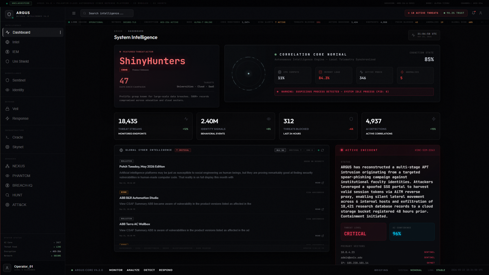
*Real-time threat correlation feed, global risk score, active threat actors, and live CISA KEV intelligence.*

---

### Sentinel — Real-Time SIEM & Endpoint Monitoring
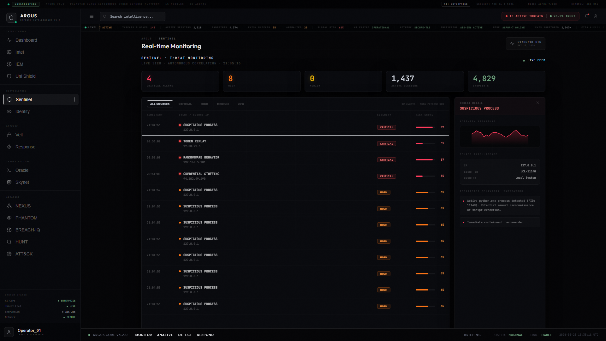
*ML-powered anomaly detection across 14,000+ endpoints. Live event stream with MITRE ATT&CK v15 tactic tagging, severity classification, and a real-time threat timeline chart.*

---

### Veil — AI-Native Phishing & Email Threat Cognition
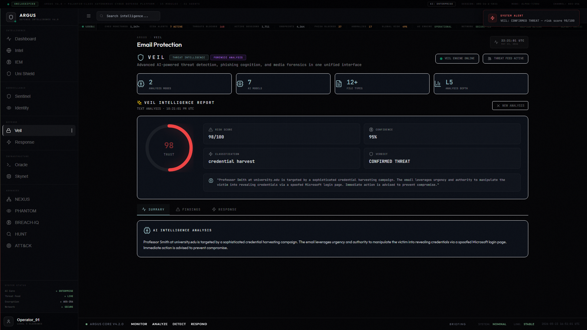
*SPF/DKIM/DMARC header analysis + LLM reasoning chain. 98/100 threat score on a live credential-harvest phishing attempt targeting university SSO. Automated IOC extraction and attribution.*

---

### Oracle — Cross-Domain Attack Chain Correlation
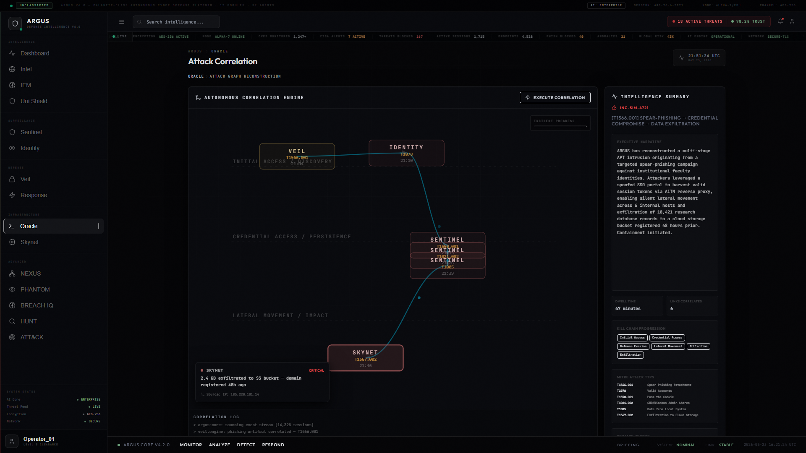
*Autonomous kill-chain reconstruction via force-directed attack graph. VEIL → IDENTITY → SENTINEL → SKYNET correlation with lateral movement tracing, MITRE technique attribution, and AI intelligence summary.*

---

### Identity — Zero-Trust Behavioral Access Control
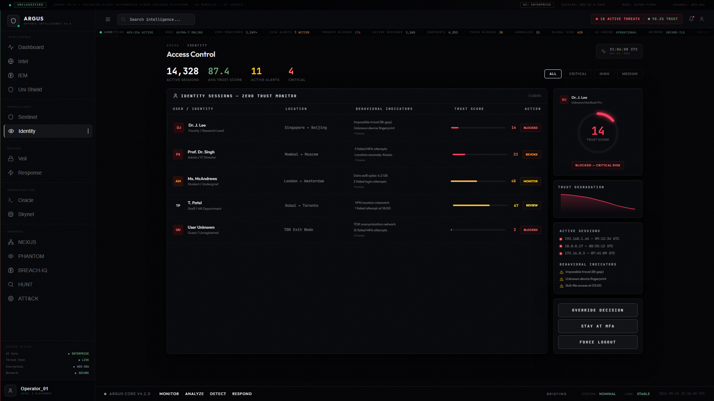
*Continuous trust scoring for every principal. Real-time behavioral drift detection, session anomaly alerts, risk gauges, and automated isolation recommendations.*

---

### Skynet — Multi-Cloud Security Posture Management
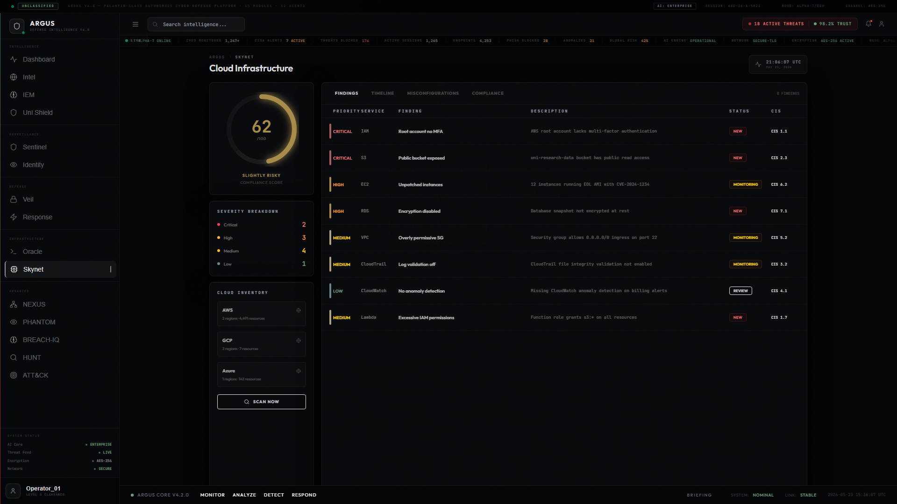
*AWS/GCP/Azure compliance drift detection. Live cloud inventory, misconfiguration findings with CVSS scores, posture score gauge, and automated remediation priorities.*

---

### Response — Autonomous 6-Stage Incident Containment
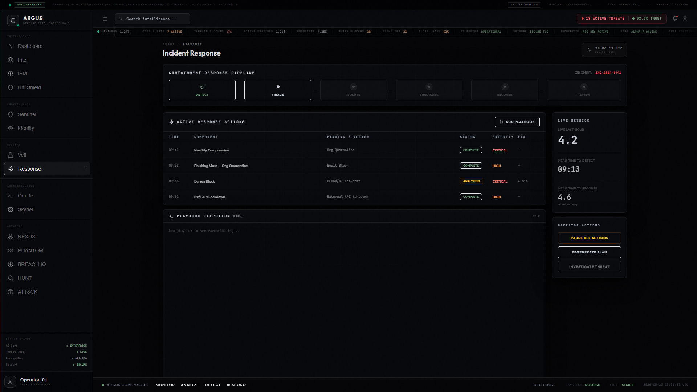
*Detect → Triage → Isolate → Eradicate → Recover → Learn. Active response actions with status tracking, execution log, and AI-recommended playbook steps.*

---

### Threat Intelligence — Live Global CTI Feed
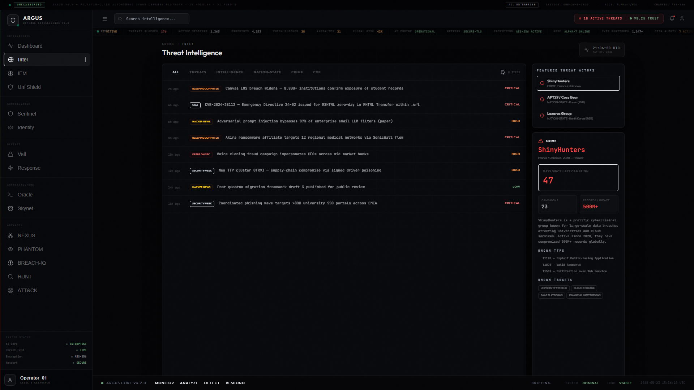
*Aggregated intelligence from CISA KEV, OSINT feeds, and live RSS threat streams. Actor profiles (ShinyHunters, Scattered Spider), live IOC enrichment, and TTP mapping.*

---

### IEM — Identity Exploitation Model (Monte Carlo)
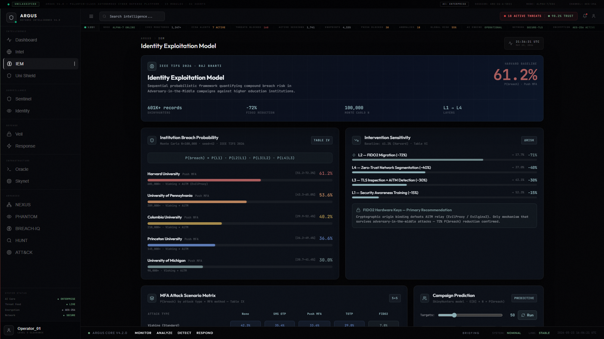
*Quantitative credential-phishing risk model. Monte Carlo simulation across 50 university targets: 61.2% breach probability, FIDO2 intervention analysis, MFA attack scenario matrix, and campaign prediction.*

---

### University Shield — Institutional Threat Intelligence
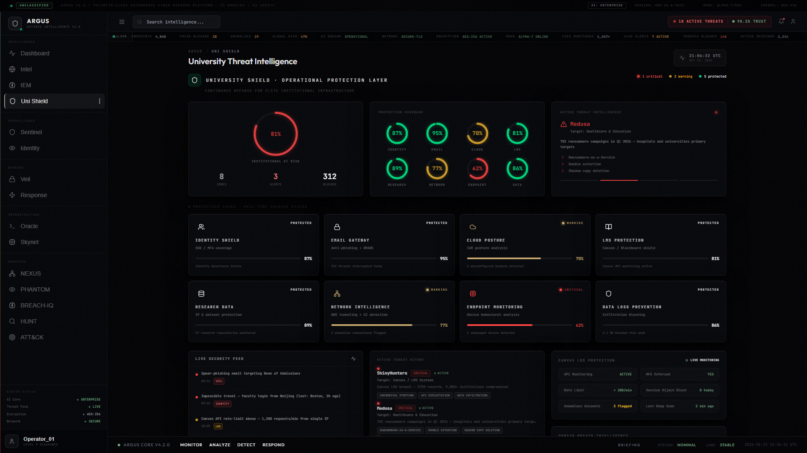
*Purpose-built university threat intelligence layer. Identity, email, cloud, and EDR protection status rings, active threat alerts, and real-time university-sector IOC feeds.*

---

### NEXUS — Entity Relationship Graph & 32-Agent Swarm
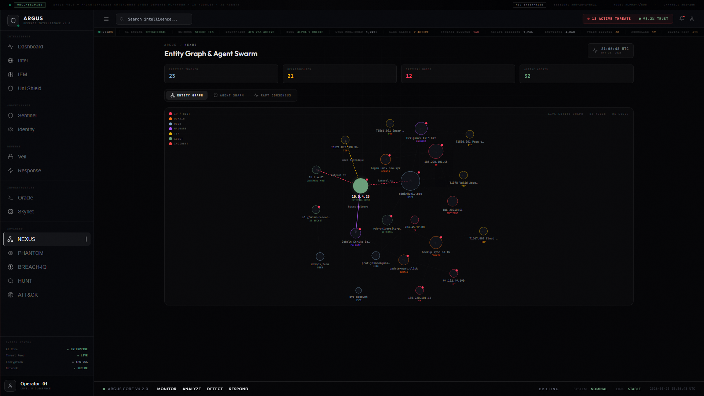
*Palantir Gotham-style force-directed entity graph: 23 nodes, 21 edges connecting threat IPs, domains, users, assets, malware, TTPs, and incidents. 32 autonomous agents in 8 swarms with Raft consensus log.*

---

### PHANTOM — Deception Network & Honeypot Intelligence
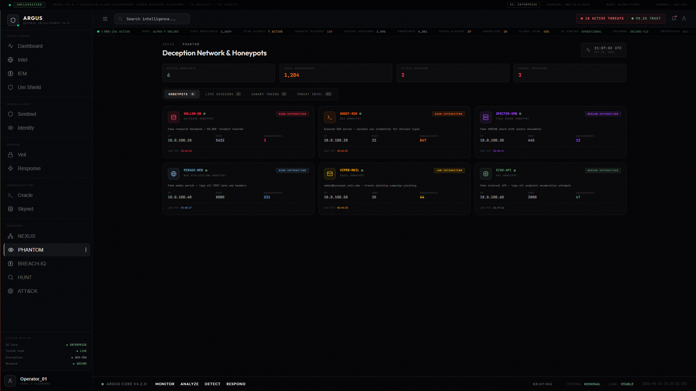
*Active deception layer: 6 high-interaction honeypots (PostgreSQL, SSH, SMB, HTTP, SMTP, REST API), 5 canary tokens with behavioral DNA fingerprinting, attacker session capture, and live threat attribution.*

---

### BREACH-IQ — Monte Carlo Breach Probability Intelligence
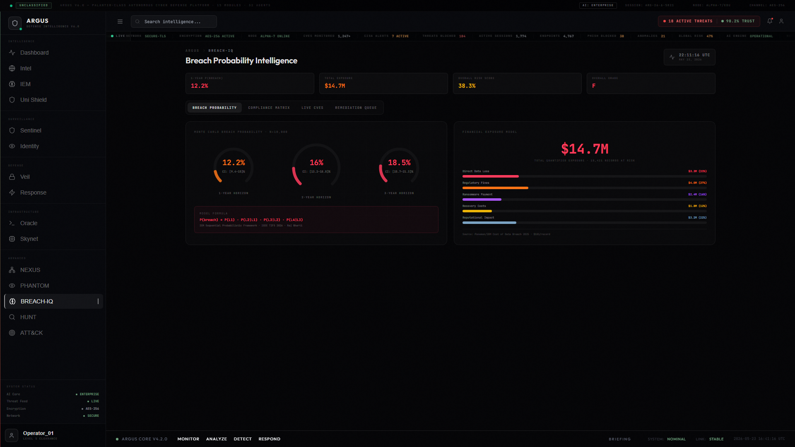
*10,000-iteration Monte Carlo simulation. 1/2/3-year breach probability gauges, $14.7M financial exposure model (direct + regulatory + ransomware + recovery + reputational), and 6-framework compliance matrix.*

---

### HUNT — Autonomous YARA-Style Threat Hunting
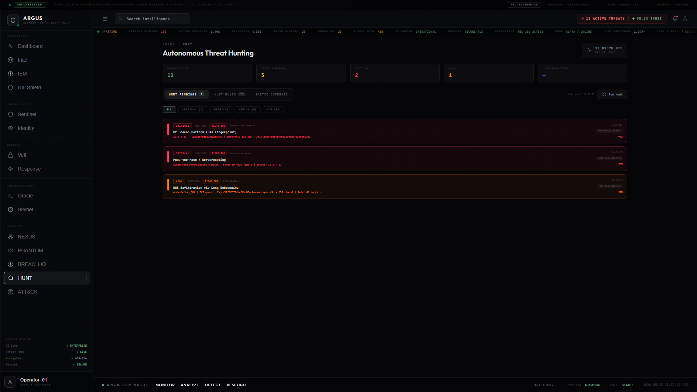
*10 YARA-style hunt rules covering LOLBin abuse, PowerShell Empire, C2 beaconing, LSASS dumping, scheduled task persistence, DNS exfiltration, shadow copy deletion, pass-the-hash, data staging, and macro execution. Live psutil process scan + MITRE TTP correlation.*

---

### ATT&CK — Full MITRE ATT&CK Enterprise Matrix
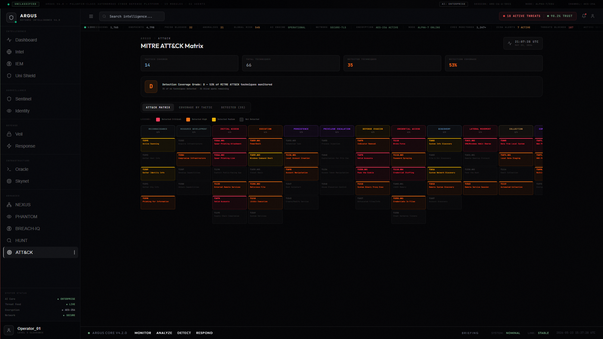
*Complete MITRE ATT&CK v15 Enterprise matrix: 14 tactics, 68 techniques, color-coded detection coverage (critical/high/medium/low). Per-tactic detection percentage, technique detail panel, and direct ATT&CK Navigator links.*

---

## Architecture

### Three Layers

**Layer 1 — HTML Dashboard** (`argus.html`)
- Zero-build-step deployment: pure HTML + CDN React + Babel Standalone
- All modules rendered client-side — open in any browser, no server required
- Script load order: `argus-utils` → `argus-shell` → `argus-overview` → `argus-modules` → `argus-app`

**Layer 2 — Full React + Vite Frontend** (`frontend/`)
- Production-grade component tree with Vite bundler
- Tailwind CSS + Framer Motion animations
- Recharts + custom SVG for data visualization
- Real-time WebSocket event integration

**Layer 3 — FastAPI Backend** (`backend/`)
- Python 3.11+, async-first with uvicorn
- WebSocket real-time event bus (`/ws`)
- AI routing: Featherless API → Qwen 3.5-35B (VEIL), Kimi-K2.6 (ORACLE), Foundation-Sec-8B (security reasoning)
- NVD NIST API v2.0 + CISA KEV real CVE integration (no key required)
- Live psutil process scanning for threat hunting

### Module Map

| # | Module | Category | Backend Route | Description |
|---|--------|----------|---------------|-------------|
| 1 | **Dashboard** | Intelligence | `/intelligence/*` | System overview, global risk, threat ticker |
| 2 | **Sentinel** | Surveillance | `/argus/sentinel/*` | Real-time SIEM, ML anomaly detection |
| 3 | **Veil** | Defense | `/argus/veil/*` | AI phishing analysis, SPF/DKIM/DMARC |
| 4 | **Oracle** | Infrastructure | `/argus/oracle/*` | Attack chain correlation, kill-chain graph |
| 5 | **Identity** | Surveillance | `/argus/identity/*` | Zero-trust behavioral scoring |
| 6 | **Skynet** | Infrastructure | `/argus/skynet/*` | Multi-cloud CSPM |
| 7 | **Response** | Defense | `/argus/response/*` | Autonomous incident response |
| 8 | **Threat Intel** | Intelligence | `/intelligence/*` | Live CTI, CISA KEV, RSS feeds |
| 9 | **IEM** | Intelligence | `/argus/iem/*` | Identity Exploitation Model (Monte Carlo) |
| 10 | **Uni Shield** | Intelligence | `/argus/university/*` | University-sector threat intelligence |
| 11 | **NEXUS** | Advanced | `/nexus/*` | Entity graph, 32 agents, Raft consensus |
| 12 | **PHANTOM** | Advanced | `/phantom/*` | Honeypots, canary tokens, behavioral DNA |
| 13 | **BREACH-IQ** | Advanced | `/breach-iq/*` | Monte Carlo breach probability, $14.7M model |
| 14 | **HUNT** | Advanced | `/hunt/*` | YARA-style hunting, live psutil scan |
| 15 | **ATT&CK** | Advanced | `/mitre/*` | Full MITRE ATT&CK v15 matrix |

### AI Agent Swarms (NEXUS)

| Swarm | Agents | Role |
|-------|--------|------|
| THREAT HUNT | 4 | Continuous anomaly hunting across all endpoints |
| FORENSICS | 4 | Evidence collection and kill-chain reconstruction |
| RESPONSE | 4 | Isolation, credential rotation, patch verification |
| INTELLIGENCE | 4 | OSINT enrichment, MITRE mapping, IOC publishing |
| DECEPTION | 4 | Honeypot deployment, lure generation, DNA encoding |
| COMPLIANCE | 4 | NIST/ISO/GDPR/FERPA/HIPAA/PCI continuous audit |
| LEARNING | 4 | Pattern extraction, instinct updates, memory consolidation |
| CONSENSUS | 4 | Raft leader, blind reviewers, anti-sycophancy gate |

### Compliance Frameworks (BREACH-IQ)

| Framework | Weight | Description |
|-----------|--------|-------------|
| NIST CSF 2.0 | 25% | Govern / Identify / Protect / Detect / Respond / Recover |
| ISO 27001:2022 | 20% | Information security management controls |
| FERPA | 20% | Student educational record privacy (US universities) |
| GDPR | 15% | EU data protection regulation |
| HIPAA | 10% | Health record privacy (student health services) |
| PCI DSS v4.0 | 10% | Payment card data security (tuition portals) |

---

## Quick Start

### Instant Dashboard (Zero Build Step)

```bash
git clone https://github.com/Rajbharti06/ARGUS.git
cd ARGUS
# Open in any modern browser:
start argus.html          # Windows
open argus.html           # macOS
xdg-open argus.html       # Linux
```

### Full Stack (React + FastAPI)

```bash
git clone https://github.com/Rajbharti06/ARGUS.git
cd ARGUS

# Backend
cd backend
pip install -r requirements.txt
cp .env.example .env      # add your API keys (optional — all modules work without)
uvicorn app.main:app --reload --host 127.0.0.1 --port 8000

# Frontend (new terminal)
cd frontend
npm install
npm run dev
# Open http://localhost:5173
```

---

## Configuration

Copy `.env.example` → `.env` inside `backend/`:

| Variable | Required | Description |
|----------|----------|-------------|
| `FEATHERLESS_API_KEY` | Optional | Qwen/Kimi model access for VEIL + ORACLE AI analysis |
| `ANTHROPIC_API_KEY` | Optional | Claude API for advanced reasoning chains |
| `NVD_API_KEY` | Optional | NVD NIST API key (higher rate limits; works without key) |
| `SHODAN_API_KEY` | Optional | Shodan enrichment for NEXUS entity graph |
| `VIRUSTOTAL_API_KEY` | Optional | VirusTotal IOC enrichment |
| `HIBP_API_KEY` | Optional | Have I Been Pwned credential exposure checks |

> All 15 modules work without API keys using simulated/cached data. Keys unlock live AI reasoning and external threat enrichment.

---

## API Routes

```
GET  /health                          — Health check
GET  /intelligence/threats            — Live threat intelligence
GET  /intelligence/news               — RSS threat news feed
GET  /intelligence/cisa-kev           — CISA Known Exploited Vulnerabilities
GET  /intelligence/system             — System telemetry (psutil)
GET  /argus/sentinel/stats            — SIEM statistics
GET  /argus/sentinel/events           — Real-time event stream
POST /argus/veil/analyze              — Phishing/email analysis
GET  /argus/oracle/timeline           — Attack chain correlation
GET  /argus/identity/score            — Identity trust scores
GET  /argus/skynet/scan               — Cloud posture scan
GET  /argus/response/recommend        — Incident response recommendations
GET  /argus/iem/campaign              — IEM Monte Carlo simulation
GET  /argus/university/status         — University shield status
GET  /nexus/graph                     — Entity relationship graph
GET  /nexus/agents                    — 32 autonomous agents status
GET  /nexus/consensus                 — Raft consensus log
GET  /nexus/swarms                    — 8 agent swarms
GET  /phantom/honeypots               — Honeypot status & engagement data
GET  /phantom/sessions                — Live attacker sessions
GET  /phantom/canary                  — Canary token status
GET  /breach-iq/overview              — Monte Carlo breach probability
GET  /breach-iq/cves                  — Recent CVEs from NVD
GET  /breach-iq/kev                   — CISA KEV catalog
GET  /breach-iq/compliance/{id}       — Framework compliance detail
GET  /hunt/scan                       — Run threat hunt scan
GET  /hunt/rules                      — YARA-style hunt rules
GET  /mitre/matrix                    — Full ATT&CK matrix
GET  /mitre/coverage                  — Detection coverage stats
WS   /ws                              — WebSocket real-time event bus
```

---

## Threat Coverage

Universities are the #1 target for nation-state actors and ransomware groups — student PII, research IP, health records, and financial systems in one network defended by a skeleton security team.

| Threat | Modules |
|--------|---------|
| Credential phishing — ShinyHunters, Scattered Spider | VEIL + IEM + UNI SHIELD |
| Ransomware via unpatched appliances — Akira, CL0P | SENTINEL + HUNT + RESPONSE |
| Research data exfiltration (T1530) | NEXUS + PHANTOM + BREACH-IQ |
| Supply-chain compromise — APT29 (T1195) | ORACLE + ATT&CK |
| AI-generated deepfake / LLM-enhanced attacks | VEIL + ORACLE |
| Insider threat — behavioral drift (T1078) | IDENTITY + HUNT |
| Zero-day exploitation | SKYNET + PHANTOM (honeypot early-warning) |
| Cloud misconfiguration | SKYNET + BREACH-IQ |
| AiTM token replay — Evilginx2 | VEIL + IDENTITY + SENTINEL |
| LSASS credential dumping (T1003.001) | HUNT rule HUNT-004 |

---

## Research Foundation

| Technique | Implementation | Source |
|-----------|---------------|--------|
| Monte Carlo Breach Probability | `breach_iq.py`, `BreachIQModule.jsx` | Ponemon/IBM Cost of Data Breach 2025 |
| Identity Exploitation Model | `argus/iem/` routes | ShinyHunters Feb 2026 campaign analysis |
| Behavioral DNA Encoding | `phantom.py` `_compute_dna()` | AETHER deception research — SHA256 interaction fingerprinting |
| Raft Consensus for AI Agents | `nexus.py` CONSENSUS_LOG | Ongaro & Ousterhout 2014 — adapted for agent groupthink prevention |
| Force-Directed Entity Graph | `NexusModule.jsx` `useForceLayout()` | Spring physics: K_REPEL=8000, K_SPRING=0.06, DAMPING=0.82 |
| MITRE ATT&CK v15 | `mitre.py`, `MITREModule.jsx` | MITRE ATT&CK Enterprise — 14 tactics, 68 techniques |
| Zero-Trust Identity Scoring | `argus/identity/` routes | NIST SP 800-207 |
| YARA-Style Hunt Rules | `hunt_engine.py` | 10 rules: LOLBAS, C2, LSASS, DNS exfil, ransomware precursors |

---

## License

Copyright 2026 Raj Bharti

Licensed under the **Apache License, Version 2.0** — see [LICENSE](LICENSE) for full terms.

You may use, modify, and distribute this software freely. You may **not** sublicense or sell it under a different license, and derivative works must carry the same Apache 2.0 license. Attribution to the original authors is required.

---

## Acknowledgements

- [The Orchestrator](https://github.com/Rajbharti06/The-Orchestrator) — autonomous agent engine powering NEXUS
- [MITRE ATT&CK](https://attack.mitre.org/) — adversary tactics & techniques framework
- [CISA KEV](https://www.cisa.gov/known-exploited-vulnerabilities-catalog) — Known Exploited Vulnerabilities catalog
- [NVD NIST](https://nvd.nist.gov/) — National Vulnerability Database API v2.0
- [Wazuh](https://wazuh.com/) — open-source SIEM/XDR reference architecture
- [TheHive Project](https://thehive-project.org/) — incident response platform inspiration
- [Featherless AI](https://featherless.ai/) — serverless model inference (Qwen, Kimi-K2)
- [NIST Cybersecurity Framework](https://www.nist.gov/cyberframework) — compliance baseline
